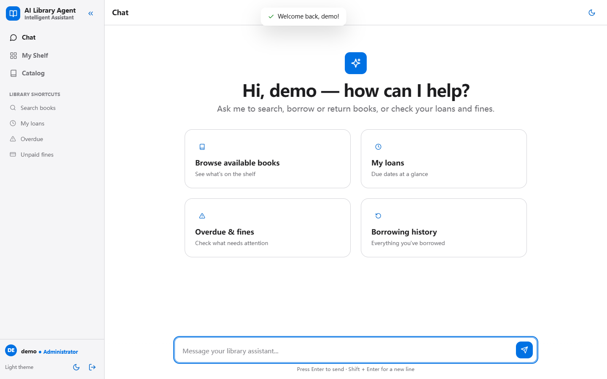
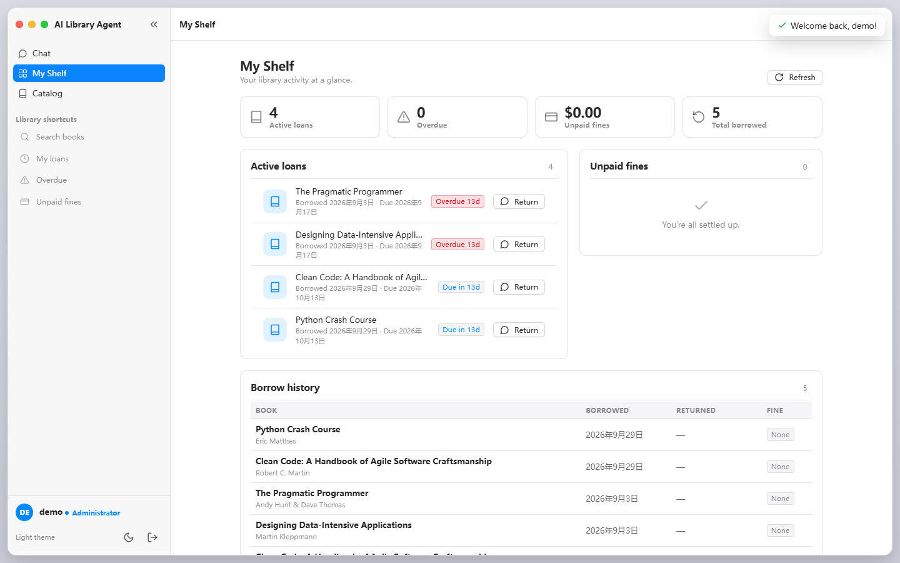
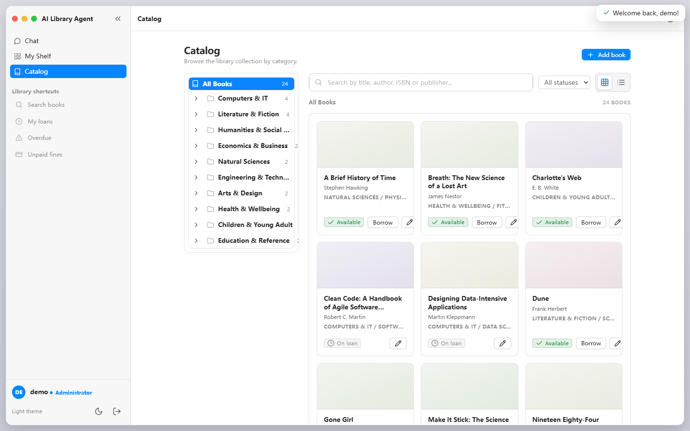
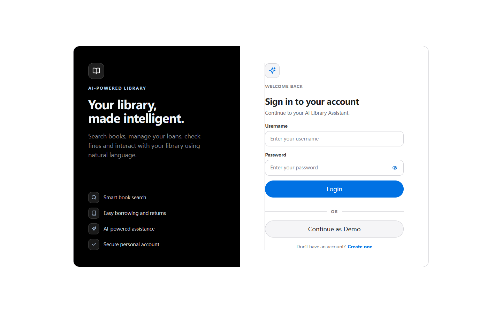

# AI Library Agent

A conversational front desk for a library. Readers ask in plain language and the agent does the work against real circulation data: search, borrow, renew, queue a hold, suggest a purchase. Self-hosted, so borrowing records never leave the institution.

[](https://github.com/XynfUturE/AI-Library-Agent/actions/workflows/ci.yml)


[](https://ai-library-agent-xof2.onrender.com)

**Live demo:** https://ai-library-agent-xof2.onrender.com — press **Continue as Demo**. The free tier sleeps after 15 minutes idle, so the first request can take 30 seconds.



### Run it locally

```bash
docker build -t ai-library-agent . && docker run -p 8000:8000 -e DEEPSEEK_API_KEY=your_key ai-library-agent
```

Then open the address the command prints (port 8000 on your own machine) and press **Continue as Demo** — that instance only exists locally. For a link you can send to someone, use the hosted demo above.

To deploy your own: `render.yaml` is a one-click Render blueprint, and the Dockerfile honours `$PORT`, so Zeabur and any other Docker host work as well.

### What this does that a book-recommendation bot cannot

| A lending app says | This project does |
| --- | --- |
| "That copy is not available" | Queues a hold, reports queue position and estimated wait, then promotes the next reader inside the return transaction |
| "We do not have that title" | Records a purchase suggestion and turns the backlog into a ranked acquisition list for the librarian |
| "Pick your fields" | "Renew Clean Code" is enough: the authenticated user id is injected server-side, never supplied by the model |

### Measured, not claimed

| Metric | Value | Source |
| --- | --- | --- |
| Tool-selection accuracy | 20/20 cases | `scripts/eval_agent.py`, raw run in `docs/eval-results.json` |
| Mean / p95 latency per request | 2.3 s / 3.7 s | same run |
| Test suite | 117 tests, fully offline | `python -m pytest` |
| Agent tools | 17 | `agent/core.py` |
| Worst-case fixed input per turn | ~9.7k tokens | `MAX_STEPS` x (system prompt + tool schemas) |
| Unbounded tool results | none | capped at 25 rows with the real total preserved |

---

## 1. Project Overview

AI Library Agent combines a traditional Python + SQLite library system with an agent that understands natural-language requests, selects the right tool, reads and writes real database data, and keeps the conversation bounded in cost. It exists to demonstrate how an LLM can drive real application logic and persistent data instead of only a chat prompt.

Instead of relying only on fixed menu commands, users can communicate with the system using natural language, for example:

* `Borrow Python Programming`
* `Do I have any overdue books?`
* `Show my borrowing history.`
* `Do I have any unpaid fines?`
* `Recommend an available programming book.`

The AI agent interprets the request, determines which tool is required, executes the corresponding Python function, retrieves real information from SQLite, and returns the result.

The application also includes authentication, user-specific data isolation, borrowing management, overdue and fine processing, payment handling, recommendations, and conversation context.

---

## 2. Main Features

### Library Management

* Search books by title keyword
* Check book availability
* Borrow books
* Return books
* Renew a loan before it is due
* Ask for a book that is not on the shelf: join the hold queue when the library owns it, or leave a purchase suggestion when it does not
* Be told when a returned copy is held for you (the next reader in the queue is promoted automatically)
* View currently borrowed books
* View overdue books
* View borrowing history
* View available books
* Cataloguing helpers for admins: `POST /api/admin/books/lookup-isbn` (OpenLibrary metadata) and `GET /api/admin/analytics` (circulation reports)

### Fine Management

* Calculate current or final fines
* View unpaid fines
* Pay unpaid fines
* Prevent payment of estimated active-loan fines
* Prevent duplicate fine payments

### Authentication

* User registration
* User login
* Demo account login
* Logout
* Password validation
* Password hashing
* Password verification
* Password change support
* Profile update support

### AI Agent

* Natural-language interaction
* LLM tool calling
* Multi-step decision making
* State management
* Context-aware references
* Borrowing decision rules
* Alternative-book handling
* Intelligent recommendations
* User-friendly error handling

### Data Security and Isolation

* User-specific borrowing records
* User-specific fines
* User-specific borrowing history
* Authentication-aware tool execution
* Prevention of cross-user returns
* Prevention of cross-user fine payments

---

## 3. AI Agent Architecture

The project follows a tool-calling agent architecture:

```text
User Request

     ↓

DeepSeek LLM
     
     ↓

Tool Selection
     
     ↓

Python Tool
     
     ↓

SQLite Database
     
     ↓

Tool Result
     
     ↓

Agent State
     
     ↓

Final Response
```

The AI does not directly modify the database.

Instead, the agent selects a predefined Python tool, and the tool performs the actual application logic and database operation.

This separation helps keep business logic deterministic while allowing natural-language interaction through the LLM.

---

## 4. Borrowing Decision Workflow

For a title-based borrowing request, the agent follows a controlled workflow:

```text
User:
"Borrow Database Systems"

        ↓

search_books

        ↓

Identify actual book ID

        ↓

check_book_availability

        ↓

If available
        ↓

borrow_book

        ↓

Return actual borrowing result
```

The agent is explicitly instructed not to invent:

* Book IDs
* Titles
* Authors
* Availability
* Due dates
* Borrowing results

A book cannot be borrowed until its availability has been verified.

---

## 5. AI Tools

The system currently provides 17 tools to the AI agent:

| Tool                         | Purpose                                           |
| ---------------------------- | ------------------------------------------------- |
| `search_books`               | Search books by title keyword                     |
| `search_books_semantic`      | Search books by meaning, for topic-style requests |
| `check_book_availability`    | Check whether a book is available                 |
| `borrow_book`                | Borrow an available book                          |
| `return_book`                | Return a book belonging to the authenticated user |
| `renew_book`                 | Extend the due date of a non-overdue loan         |
| `request_book`               | Queue a hold, or record a purchase suggestion     |
| `get_my_holds`               | List the current user's holds and suggestions     |
| `cancel_hold`                | Withdraw one of the user's own requests           |
| `get_current_borrowed_books` | Retrieve active loans for the current user        |
| `get_overdue_books`          | Retrieve overdue active loans                     |
| `get_book_loan_details`      | Retrieve active or latest returned loan details   |
| `calculate_fine`             | Calculate current or final fine                   |
| `get_unpaid_fines`           | Retrieve unpaid fines for the current user        |
| `pay_fine`                   | Pay an unpaid final fine                          |
| `get_borrow_history`         | Retrieve the current user's borrowing history     |
| `list_available_books`       | Retrieve currently available books                |

`search_books_semantic` is the retrieval (RAG) tool. Every book is
embedded once and stored in the `book_embeddings` table, and a query is
answered by cosine similarity against those vectors, so "a book about
how sleep affects memory" finds *Why We Sleep* without sharing a single
title word. By default the embedder is a dependency-free local vector
(hashed words plus character n-grams), which keeps retrieval working
offline and in tests; setting `EMBEDDING_API_KEY` and `EMBEDDING_MODEL`
switches it to any OpenAI-compatible embeddings endpoint. The index
records which embedder produced it and rebuilds itself when the
catalogue or the embedder changes. See `agent/retrieval.py`.

The tool schemas and the system prompt are defined once in `agent/core.py`, the agent loop lives in `LibraryAgent` (also `agent/core.py`), and the actual business logic is implemented in `agent/tools.py`. The web UI and the terminal CLI both drive the same `LibraryAgent`, so there is only one loop to maintain.

---

## 6. Authentication and User Data Isolation

Each session owns one `LibraryAgent` instance, which holds the identity of the currently authenticated user.

User-specific operations receive the authenticated user's ID automatically.

For example:

```text
Authenticated User
        
        ↓

LibraryAgent.user_id
        
        ↓

execute_tool()
        
        ↓

User-specific Python tool
        
        ↓

SQLite query with user_id filtering
```

This prevents one user from accessing another user's:

* active loans
* overdue books
* unpaid fines
* borrowing history

Write operations are also protected.

For example, a user cannot:

* return another user's book
* pay another user's fine

The system verifies ownership at the database-operation level rather than relying only on the user interface.

---

## 7. Borrowing and Fine System

The library currently uses the following policies:

```text
Loan period: 14 days
Fine: $0.50 per overdue calendar day
```

For active loans, the fine is an estimated current amount.

For returned loans, the fine is stored as the final recorded amount.

This distinction is important because estimated fines cannot be paid until the related book has been returned.

---

## 8. Recommendation System

Recommendations are separated from borrowing actions.

For example:

```text
User:
"Recommend an available programming book."
```

The agent:

1. Retrieves actual available books.
2. Selects books based on the user's request.
3. Provides a short reason for the recommendation.
4. Does not automatically borrow the recommended book.

This prevents unintended write operations.

---

## 9. Conversation and Context

The agent maintains conversation history so that contextual references can be understood.

Examples include:

* `it`
* `this book`
* `that one`
* `the recommended one`
* `another one`

For example:

```text
User:
Recommend a programming book.

Agent:
Python Programming is available...

User:
Can I borrow that one?
```

The agent can use the previous conversation context when the reference is unambiguous.

### Keeping the per-turn cost bounded

Every step of the agent loop resends the system prompt, the tool schemas and the whole conversation, and the model may run several steps for one question. Three limits keep that bounded:

* `MAX_STEPS` (5) caps the LLM calls per user turn.
* The conversation window keeps only the most recent user turns, and trims in batches so the prompt cache keeps matching.
* Tool results are capped before they enter the context: a list longer than 25 rows arrives as `{"total": n, "returned": 25, "truncated": true, "items": [...]}`, so the model still knows the real count. Only the LLM sees this copy — the web UI keeps the complete data.

`[usage]` lines on stdout report `prompt` / `cache_hit` / `cache_miss` / `completion` / `reasoning` per step, which is the fastest way to see where the tokens actually go.

---

## 10. Agent State

All per-session state lives in the `LibraryAgent` instance:

* the authenticated user ID (injected into every tool call, never supplied by the LLM)
* the conversation history
* the trim window that bounds prompt size

Task progress is not stored in a separate state machine. The model reports what it is doing through tool calls, and the tool results are the only source of truth for the answer, so there is no parallel bookkeeping to keep in sync.

---

## 11. Error Handling

The application separates internal errors from user-facing messages.

The system avoids exposing:

* SQL statements
* stack traces
* internal implementation details
* private API information

Instead, users receive simple messages such as:

```text
The library operation could not be completed.
```

Debug information can be enabled through:

```python
DEBUG_MODE = True
```

during development when necessary.

---

## 12. Database Design

The application uses SQLite for persistent storage.

Main tables include:

### `users`

Stores account information:

* user ID
* username
* password hash
* full name
* email
* account status (`active`)
* role (`member` / `admin`)
* creation time

### `books`

Stores library catalogue information:

* book ID
* title
* author
* availability (a cache of "no active loan": repaired at startup, and the admin API refuses to mark a borrowed book as available)
* category reference
* ISBN
* publisher
* publication date
* language
* location

### `categories`

Stores the hierarchical category tree used by the catalog:

* category ID
* parent ID (self-reference, `NULL` for top-level categories)
* name
* sort order
* active flag

### `borrow_records`

Stores borrowing transactions:

* record ID
* user ID
* book ID
* book title
* borrowed date
* due date
* returned date
* final fine amount
* fine payment status
* payment date
* renewals used

### `holds`

The demand queue, shared by holds and purchase suggestions:

* request ID and reader ID
* book reference (NULL for a purchase suggestion)
* title as asked for
* kind: `hold` (library owns it, all copies out) or `suggestion` (library does not own it)
* status: `waiting` -> `ready` (a returned copy is held for that reader) -> `cancelled`
* created time and the time it became ready

### `book_embeddings` and `rag_meta`

The semantic search index: one vector per book, plus a metadata row recording
which embedder and which catalogue state produced the index, so the index
rebuilds itself whenever either changes.

---

## 13. Transaction Safety

Database write operations use transactions and rollback protection.

The project uses patterns such as:

```python
try:
    ...
    connection.commit()

except Exception:
    connection.rollback()

finally:
    connection.close()
```

Some sensitive operations also use immediate transactions to reduce race-condition risks when changing borrowing or payment state.

---

## 14. Technology Stack

| Technology    | Role                                 |
| ------------- | ------------------------------------ |
| Python 3.10+  | Application and business logic       |
| FastAPI       | Web API framework                    |
| uvicorn       | ASGI server                          |
| Jinja2        | HTML templating                      |
| SQLite        | Persistent database                  |
| DeepSeek API  | LLM / AI agent (OpenAI-compatible)   |
| OpenAI SDK    | API integration                      |
| python-dotenv | Environment configuration            |
| Rich          | Terminal UI (CLI)                    |
| Vanilla JS    | Browser front-end (no build step)    |
| CSS           | Token-based design system            |

---

## 15. Project Structure

```text
.
├── main.py                 # Terminal CLI (thin client over LibraryAgent)
├── requirements.txt
├── requirements-dev.txt    # Test-only dependencies
├── requirements-mcp.txt    # Optional MCP server dependency
├── pytest.ini
├── render.yaml             # One-click deploy blueprint (Render)
├── Dockerfile
├── .dockerignore
├── .env.example
├── .gitignore
├── README.md
├── README_CN.md
│
├── agent/                  # Shared business layer
│   ├── auth.py
│   ├── analytics.py        # Librarian reporting queries
│   ├── catalog.py
│   ├── core.py             # Single agent loop + tool schemas
│   ├── database.py         # SQLite schema, migrations + seed data
│   ├── isbn.py             # ISBN -> metadata (OpenLibrary)
│   ├── retrieval.py        # Book embeddings + semantic search
│   ├── trace.py            # Per-turn JSON trace (tokens, tools, latency)
│   └── tools.py            # Library business logic
│
├── scripts/
│   ├── capture_screenshots.py  # Regenerate docs/screenshots
│   ├── due_reminders.py    # Cron-friendly due-date/overdue listing
│   ├── eval_agent.py       # Tool-selection accuracy, latency, token cost
│   ├── isbn_lookup.py      # ISBN lookup from the command line
│   └── mcp_server.py       # Optional MCP server (needs requirements-mcp.txt)
│
├── docs/
│   ├── eval-results.json   # Raw output of the last eval run
│   └── screenshots/        # UI screenshots used by this README
│
├── tests/                  # pytest suite (offline, throwaway database)
│   ├── conftest.py
│   ├── test_agent_loop.py
│   ├── test_analytics.py
│   ├── test_catalog.py
│   ├── test_due_reminders.py
│   ├── test_eval_grading.py
│   ├── test_fines.py
│   ├── test_holds.py
│   ├── test_isbn.py
│   ├── test_loans.py
│   ├── test_mcp_server.py
│   ├── test_pagination.py
│   ├── test_prompt_injection.py
│   ├── test_reminders.py
│   ├── test_retrieval.py
│   ├── test_trace.py
│   └── test_web_api.py
│
├── .github/workflows/ci.yml
│
└── web/                    # FastAPI application
    ├── app.py
    ├── models.py
    ├── session.py          # In-memory session store
    ├── templates/
    │   └── index.html
    └── static/
        ├── assets/
        ├── css/
        │   ├── tokens.css
        │   ├── base.css
        │   ├── components.css
        │   └── views/
        └── js/
            ├── app.js
            ├── lib/
            └── views/
```

The `database/` directory is created at runtime and holds the local SQLite files. It is git-ignored and never committed.

---

## 16. Installation

### 1. Clone or copy the project

```bash
git clone <your-repository-url>
cd AI-Agent-Learning
```

### 2. Create a virtual environment

Windows:

```powershell
python -m venv .venv
```

### 3. Activate the environment

```powershell
.\.venv\Scripts\Activate.ps1
```

### 4. Install dependencies

```powershell
python -m pip install -r requirements.txt
```

---

## 17. Environment Configuration

Create a local `.env` file:

```env
DEEPSEEK_API_KEY=your_deepseek_api_key_here
ENABLE_DEMO_LOGIN=1
CHAT_RATE_LIMIT_PER_MINUTE=20
# LIBRARY_DB_PATH=/data/library.db
# AGENT_TRACE_PATH=database/agent-trace.jsonl
```

The project reads the key through:

```python
os.getenv("DEEPSEEK_API_KEY")
```

`ENABLE_DEMO_LOGIN` toggles the password-less demo login. It defaults to enabled so the app works out of the box; set it to `0` to disable the endpoint in production.

`CHAT_RATE_LIMIT_PER_MINUTE` caps how often one session may call the chat endpoints. Chat is the only endpoint that spends real money, so it is limited to 20 requests per minute per session by default; set it to `0` to disable the limit.

`LIBRARY_DB_PATH` is optional. It points the app (and the tests) at a different SQLite file instead of `database/library.db`, which is handy when mounting a persistent volume. A non-numeric `CHAT_RATE_LIMIT_PER_MINUTE` is ignored with a warning and the default of 20 is used.

`AGENT_TRACE_PATH` is optional and turns on per-turn tracing. Each line is one JSON object: every LLM call with prompt/cache/completion/reasoning tokens and its latency, every tool call with the arguments the model sent and the outcome, and one summary line per turn. The same records go to the `library_agent.trace` logger, so a host can ship them through normal structured logging instead of reading the file.

Delivery of due-date reminders is configured separately, because `scripts/due_reminders.py` is the only component that sends anything:

```env
SMTP_HOST=smtp.example.com
SMTP_PORT=587
SMTP_USER=library@example.com
SMTP_PASSWORD=your_smtp_password
SMTP_FROM=library@example.com
SMTP_TLS=1
```

Without `SMTP_HOST` the script still prints the list and exits with a clear error for `--email`.

Do not commit `.env` to Git.

A safe template is provided as:

```text
.env.example
```

---

## 18. Running the Application

### Option A: Web UI (recommended)

Start the FastAPI server:

```powershell
python -m uvicorn web.app:app --port 8000
```

Open the address uvicorn prints in a browser.

The web UI provides:

* Login / Register / Continue as Demo authentication
* A chat interface with streaming agent replies (SSE) and live tool-call step cards
* A "My Shelf" dashboard: loan stats, active loans with due-date badges, unpaid fines, borrow history, and a searchable catalog
* Collapsible sidebar with library shortcuts, light/dark theme (follows the system, manually toggleable), and session restore across page refreshes

The list endpoints page in SQL and report the unpaged size, so a growing catalogue never has to be sent in one response:

```text
GET /api/books?q=code&limit=20&offset=0   ->  {items, total, limit, offset}
GET /api/shelf/history?limit=10&offset=0  ->  {items, total}
```

Mutations (borrow, return, pay fine) intentionally go through the AI agent in the chat view; the dashboard itself stays read-only.

 

### Option B: Terminal CLI

Start the application with:

```powershell
python main.py
```

The application opens an authentication screen.

Available options include:

```text
1. Login
2. Register
3. Continue as Demo
4. Exit
```

After authentication you land in the chat view. The CLI is a thin client over the same `LibraryAgent` the web UI uses:

* anything you type goes to the agent (with the signed-in user's identity)
* slash commands call the tools directly, without spending tokens

```text
/search <text>   search books
/borrow <id>     borrow a book
/return <id>     return a book
/check <id>      check availability
/request <id|title>  queue a hold, or suggest a purchase
/cancel <hold id>    withdraw your request
/available       list books on the shelf
/loans           list your current loans
/holds           list your holds and suggestions
/overdue         list your overdue books
/fines           list your unpaid fines
/history         list your borrowing history
/help            show the command list
/quit            exit
```

### Option C: Docker (containerized)

```powershell
docker build -t ai-library-agent .
docker run -p 8000:8000 -e DEEPSEEK_API_KEY=your_deepseek_api_key_here ai-library-agent
```

The image runs as a non-root user and exposes a built-in health check. Any container platform (Docker, Zeabur, Render, etc.) that injects a `PORT` environment variable is supported via the entry-point's `${PORT:-8000}` fallback.

For a local stack without typing the flags yourself, `docker-compose.yml` starts the web app on port 8000 and the optional MCP server on port 8001, sharing one SQLite volume:

```powershell
docker compose up --build
```

The MCP service is the same image built with `INSTALL_MCP=1` and serves the 17 library tools over streamable HTTP at `http://localhost:8001/mcp`.

### Option D: MCP server (optional)

The same tools can be exposed to any MCP client (Codex, Claude Desktop, ...) instead of the bundled chat UI:

```powershell
pip install -r requirements.txt -r requirements-mcp.txt
python scripts/mcp_server.py --user-id 1
```

MCP has no session concept, so the server is bound to one library user at startup and injects that user id into every call, exactly like the web chat does. The MCP SDK pulls in about ten extra packages, which is why it lives in a separate requirements file.

### Option E: Deploy

The reference instance runs on Render at https://ai-library-agent-xof2.onrender.com.

`render.yaml` is a Render blueprint for this repository: it builds the `Dockerfile`, sets the health check to `/`, and leaves `DEEPSEEK_API_KEY` to be filled in from the dashboard (`sync: false`), so no secret is committed.

```text
Render:  New + -> Blueprint -> pick this repository
Zeabur:  New project -> deploy from Git (the Dockerfile handles $PORT)
```

Both platforms inject `PORT`, which the entry point already honours. The Render free plan has no persistent disk, so `database/library.db` is rebuilt from the seed data on each deploy; attach a disk and set `LIBRARY_DB_PATH` if the data must survive.

Due-date reminders and backups are not part of the web process. Run `scripts/due_reminders.py` from a scheduler (Render cron job, GitHub Actions schedule, or Windows Task Scheduler) with `--email` or `--webhook`.

---

## 19. Demo Account

The project includes a local demo account for development and demonstration.

Press **Continue as Demo** to sign in as that account. It holds the `admin` role, so the librarian views (circulation reports, cataloguing, CSV import) are reachable from the same login.



The final local demo database is intentionally kept separate from the development test data.

The demo environment contains a small amount of realistic borrowing data so that the AI can demonstrate:

* current loans
* borrowing history
* availability
* overdue checking
* fine checking

---

## 20. Testing

### Automated tests

The suite runs fully offline: the LLM client is faked and the database is a throwaway file (see `tests/conftest.py`), so it needs no API key and never touches `database/library.db`.

```powershell
pip install -r requirements.txt -r requirements-dev.txt
python -m pytest
```

| Test file                | Covers                                                              |
| ------------------------ | ------------------------------------------------------------------- |
| `test_fines.py`          | Fine arithmetic, calendar-day boundaries                            |
| `test_loans.py`          | Borrow / return / overdue fine / payment idempotency, data isolation |
| `test_catalog.py`        | Create / update / CSV import, ISBN uniqueness, availability invariant |
| `test_reminders.py`      | Due-soon listing, renew rules (limit, overdue, other users)          |
| `test_agent_loop.py`     | Tool dispatch, SSE events, history rollback, schema/dispatch parity  |
| `test_web_api.py`        | Session guard, demo login, chat, 429 rate limiting                   |
| `test_mcp_server.py`     | Optional MCP server exposes exactly the agent's tools (auto-skipped when `requirements-mcp.txt` is not installed) |
| `test_isbn.py`           | ISBN validation, OpenLibrary parsing, author lookup, failure paths   |
| `test_analytics.py`      | Overview counters, top books, monthly buckets                        |
| `test_due_reminders.py`  | Digest building, SMTP delivery, webhook POST, failure reporting      |
| `test_holds.py`          | Hold queue positions, promotion on return, suggestions, withdrawal   |
| `test_retrieval.py`      | Local vectors, index build/refresh, meaning-only ranking             |
| `test_prompt_injection.py` | Tool results stay data: private fields stripped, allow-list fixed, unknown tools refused |
| `test_trace.py`          | One trace record per LLM step, tool call and turn, plus the failure path |
| `test_pagination.py`     | Catalogue pages, unpaged totals, invalid pages, history paging       |
| `test_eval_grading.py`   | Answer grading: refusal, empty answer, missing or forbidden content  |

GitHub Actions runs the same command on every push and pull request (`.github/workflows/ci.yml`).

### Reproducing the published numbers

```powershell
# Tool selection, answer checks, latency and token cost (uses the real
# model, runs against a throwaway database)
python scripts/eval_agent.py --json docs/eval-results.json

# Regenerate the screenshots (needs a running server and playwright)
pip install playwright
python scripts/capture_screenshots.py
```

Each case carries two verdicts: `matched` (the agent reached for the right tool) and `answer_ok` (the reply is non-empty, stays on topic, and does not fall back to a refusal or an internal error string). Answer checking is deliberately deterministic instead of a second model grading the first: no extra paid call per case, and the score does not drift between runs. The raw JSON keeps the full reply text for every case, so a weak answer can be read rather than guessed at.

### Manual testing

The project has also been exercised manually across the following areas.

### Functional Testing

* Book search
* Availability checking
* Borrowing
* Returning
* Current loans
* Overdue detection
* Fine calculation
* Fine payment
* Borrowing history
* Recommendations

### AI Agent Testing

* Tool selection
* Multi-step borrowing workflow
* Availability verification
* Alternative-book handling
* Context handling
* Error handling
* Duplicate tool-call prevention

### Authentication Testing

* Registration
* Login
* Demo login
* Logout
* Password verification

### Data Isolation Testing

* User-specific borrowing history
* User-specific current loans
* User-specific fines
* Cross-user return protection
* Cross-user payment protection

### Database Integrity Testing

* No orphan borrowing records
* No duplicate active loans
* Active loan consistency
* Book availability consistency

---

## 21. Security Considerations

The project follows several basic security practices:

* API keys are stored in environment variables.
* `.env` is excluded from Git.
* Passwords are stored using password hashing.
* User-specific operations use authenticated user IDs.
* Cross-user operations are rejected by backend logic.
* Database transactions use rollback handling.
* Internal errors are not exposed to normal users.
* Tool results are treated as untrusted data: private fields are stripped before a result reaches the model, the tool allow-list is fixed by the application, and an unknown tool name is refused instead of dispatched. `tests/test_prompt_injection.py` drives a payload that tries all three.
* Chat requests are rate limited per session (in-memory counters, so the limit is per worker).
* Session tokens are random and sent in an `X-Session-ID` header from `sessionStorage`; no cookie is attached automatically, so there is no ambient-credential CSRF surface.
* Demo login is password-free by design and enabled by default; set `ENABLE_DEMO_LOGIN=0` on a real deployment.
* Sessions live in process memory, which is why the container runs a single worker (`--workers 1`); scaling out needs a shared session store first.

---

## 22. Version Control

The project is tracked with Git. The default branch (`master`) holds the current stable state, and changes are committed as focused, self-describing commits (see the repository history).

---

## 23. Future Improvements

Shipped already: semantic search, holds and purchase suggestions, the librarian
reporting API, the offline test suite, CI and the Render blueprint. What is
still genuinely missing:

* Persistent long-term AI memory across sessions
* Better recommendation ranking
* A model-as-judge pass on top of the deterministic answer checks, for cases where wording quality matters
* Token-level streaming of the final LLM answer (the UI streams step events, then delivers the answer as one chunk)
* Server-side session and conversation persistence (sessions are in process memory, single worker)
* A shared database instead of a container-local SQLite file
* Shipping the trace file to a collector instead of a local JSONL file
* Authentication hardening (JWT/OAuth, CSRF protection, HTTPS-only transport)

---

## 24. Project Goal

This project was built as a practical exploration of AI agents rather than as a simple chatbot.

The main objective is to demonstrate how an LLM can be connected to real application tools, persistent data, controlled business logic, authentication, and multi-step decision making.

The project therefore combines:

```text
LLM
+
Tool Calling
+
Agent State
+
Business Logic
+
SQLite
+
Authentication
+
Data Isolation
+
Natural Language Interaction
```

into a single working application.

---

## 25. License

This project is licensed under the [MIT License](LICENSE).

---

*A Chinese version of this document is available in [README_CN.md](README_CN.md).*
